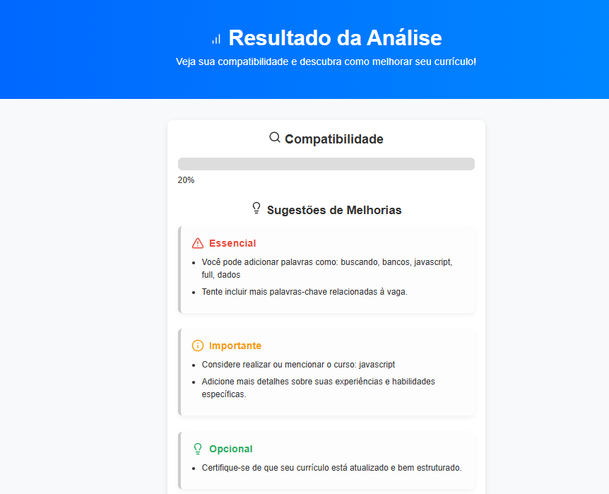

# 🤖 Analisador de Currículos com IA


> Um app inteligente que compara o seu currículo com uma vaga de emprego e sugere melhorias com base em palavras-chave, competências exigidas e muito mais!

---

## 🎥 Preview



---

## 🚀 Funcionalidades

- 📥 Análise de compatibilidade entre currículo e vaga
- 🧠 Uso de NLP (Processamento de Linguagem Natural)
- 🔍 Identificação de palavras-chave ausentes
- 📊 Geração de gráfico com pontos fortes e fracos
- ✅ Sugestões de melhorias organizadas por prioridade:
  - Essenciais
  - Importantes
  - Opcionais
- 🧾 Modelo de currículo ideal baseado na vaga

---

## 🛠️ Tecnologias

- Python + Flask
- HTML5 + CSS3
- JavaScript
- NLTK (Natural Language Toolkit)
- Lucide Icons
- Chart.js

---

## 📦 Como executar localmente

```bash
# Clone o repositório
git clone https://github.com/mateus/analisador-curriculos.git

# Acesse a pasta
cd analisador-curriculos

# Crie o ambiente virtual (opcional)
python -m venv venv
source venv/bin/activate  # Linux/macOS
venv\Scripts\activate     # Windows

# Instale as dependências
pip install -r requirements.txt

# Inicie o servidor
python app.py

Desenvolvido com dedicação por Mateus 💙
